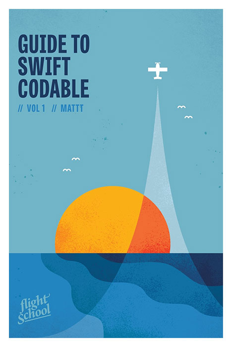

<a href="https://flight.school/books/codable">
    
</a>

# Guide to Swift Codable Sample Code

[![Build Status][build status badge]][build status]
[![License][license badge]][license]
[![Swift Version][swift version badge]][swift version]

This repository contains sample code used in the
[Flight School Guide to Swift Codable](https://flight.school/books/codable).

---

### Chapter 1

Chapter 1 introduces `Codable` by way of a round-trip journey ---
going from model to JSON representation and back again.

#### Plane

```swift
let json = """
{
    "manufacturer": "Cessna",
    "model": "172 Skyhawk",
    "seats": 4,
}
""".data(using: .utf8)!

let decoder = JSONDecoder()
let plane = try! decoder.decode(Plane.self, from: json)
```

### Chapter 2

Chapter 2 follows a more complicated example with
nested structures, mismatched keys, and timestamps.

#### Flight Plan

```swift
let json = """
{
    "aircraft": {
        "identification": "NA12345",
        "color": "Blue/White"
    },
    "route": ["KTTD", "KHIO"],
    "departure_time": {
        "proposed": "2018-04-20T15:07:24-07:00",
        "actual": "2018-04-20T15:07:24-07:00"
    },
    "flight_rules": "IFR",
    "remarks": null
}
""".data(using: .utf8)!

let decoder = JSONDecoder()
decoder.dateDecodingStrategy = .iso8601

let plan = try! decoder.decode(FlightPlan.self, from: json)
```

### Chapter 3

Chapter 3 shows what to do when `Codable` conformance
can’t be synthesized by the compiler.

In the process, we share an implementation of a type-erased
[`AnyCodable`](https://github.com/Flight-School/AnyCodable) type.

#### AnyDecodable

```swift
struct Report: Decodable {
    var title: String
    var body: String
    var metadata: [String: AnyDecodable]
}
```

#### Coordinates

```swift
let json = """
{
    "coordinates": [
        {
            "latitude": 37.332,
            "longitude": -122.011
        },
        [-122.011, 37.332],
        "37.332, -122.011"
    ]
}
""".data(using: .utf8)!

let decoder = JSONDecoder()
let coordinates = try! decoder.decode([String: [Coordinate]].self, from: json)["coordinates"]
```

#### EconomySeat

```swift
class EconomySeat: Decodable {
    var number: Int
    var letter: String
    // ...
}

class PremiumEconomySeat: EconomySeat {
    var mealPreference: String?
    // ...
}

let json = """
{
    "number": 7,
    "letter": "A",
    "mealPreference": "vegetarian"
}
""".data(using: .utf8)!

let decoder = JSONDecoder()
let seat = try! decoder.decode(PremiumEconomySeat.self, from: json)
```

#### EitherBirdOrPlane

```swift
let json = """
[
    {
        "type": "bird",
        "genus": "Chaetura",
        "species": "Vauxi"
    },
    {
        "type": "plane",
        "identifier": "NA12345"
    }
]
""".data(using: .utf8)!

let decoder = JSONDecoder()
let objects = try! decoder.decode([Either<Bird, Plane>].self, from: json)
```

#### FuelPrice

```swift
protocol FuelPrice {
    var type: Fuel { get }
    var pricePerLiter: Double { get }
    var currency: String { get }
}

struct CanadianFuelPrice: Decodable {
    let type: Fuel
    let price: Double /// CAD / liter
}

extension CanadianFuelPrice: FuelPrice {
    var pricePerLiter: Double {
        return self.price
    }

    var currency: String {
        return "CAD"
    }
}
```

#### Pixel

```swift
let encoder = JSONEncoder()
encoder.userInfo[.colorEncodingStrategy] =
    ColorEncodingStrategy.hexadecimal(hash: true)

let cyan = Pixel(red: 0, green: 255, blue: 255)
let magenta = Pixel(red: 255, green: 0, blue: 255)
let yellow = Pixel(red: 255, green: 255, blue: 0)
let black = Pixel(red: 0, green: 0, blue: 0)

let json = try! encoder.encode([cyan, magenta, yellow, black])
```

#### Route

```swift
let json = """
{
    "points": ["KSQL", "KWVI"],
    "KSQL": {
        "code": "KSQL",
        "name": "San Carlos Airport"
    },
    "KWVI": {
        "code": "KWVI",
        "name": "Watsonville Municipal Airport"
    }
}
""".data(using: .utf8)!

let decoder = JSONDecoder()
let route = try decoder.decode(Route.self, from: json)
```

### Chapter 4

Chapter 4 is a case study in which you build search functionality
for a music store app using the iTunes Search API
(but really, it’s a lesson about command-line tools and epistemology).

We also released
[`AppleiTunesSearchURLComponents`](https://github.com/Flight-School/AppleiTunesSearchURLComponents)
as a standalone component.

#### Music Store

```swift
viewController.search(for: Music.self, with: <#artist#>)
```

### Chapter 5

Chapter 5 shows you how to use `Codable` with `UserDefaults`
by way of an example app for tabulating in-flight snack orders.

#### In Flight Service

```swift
guard let url = Bundle.main.url(forResource: "Inventory", withExtension: ".plist") else {
    fatalError("Inventory.plist missing from main bundle")
}

let inventory: [Item]
do {
    let data = try Data(contentsOf: url)

    let decoder = PropertyListDecoder()
    let plist = try decoder.decode([String: [Item]].self, from: data)
    inventory = plist["items"]!
} catch {
    fatalError("Cannot load inventory \(error)")
}
```

### Chapter 6

Chapter 6 is about how Codable fits into a Core Data stack.
The example app for this chapter is a luggage tag scanner
that reads JSON from QR codes.

#### Luggage Scanner

```swift
do {
    for image in tagsAtDeparture {
        try scanner.scan(image: image, at: .origin, in: context)
    }

    try context.save()
} catch {
    fatalError("\(error)")
}
```

### Chapter 7

Chapter 7 is a doozy. It walks through a complete implementation of a Codable-compatible encoder for the MessagePack format, from start to finish.

A complete `Codable`-compliant implementation is available at
[Flight-School/MessagePack](https://github.com/Flight-School/MessagePack).
If you're interested in building your own `Codable` encoder or decoder,
check out our [DIY Kit](https://github.com/Flight-School/Codable-DIY-Kit).

#### MessagePackEncoder

```swift
let plane = Plane(manufacturer: "Cirrus",
                  model: "SR22",
                  seats: 4)

let encoder = MessagePackEncoder()
let data = try! encoder.encode(plane)
```

## License

MIT

## About Flight School

Flight School is a book series for advanced Swift developers
that explores essential topics in iOS and macOS development
through concise, focused guides.

If you'd like to get in touch,
feel free to [message us on Twitter](https://twitter.com/flightdotschool)
or email us at <info@flight.school>.

[build status]: https://travis-ci.org/Flight-School/Guide-to-Swift-Codable-Sample-Code
[build status badge]: https://api.travis-ci.com/Flight-School/Guide-to-Swift-Codable-Sample-Code.svg?branch=master
[license]: http://img.shields.io/badge/license-MIT-blue.svg?style=flat
[license badge]: http://img.shields.io/badge/license-MIT-blue.svg?style=flat
[swift version]: https://swift.org/download/
[swift version badge]: http://img.shields.io/badge/swift%20version-5.0-orange.svg?style=flat
